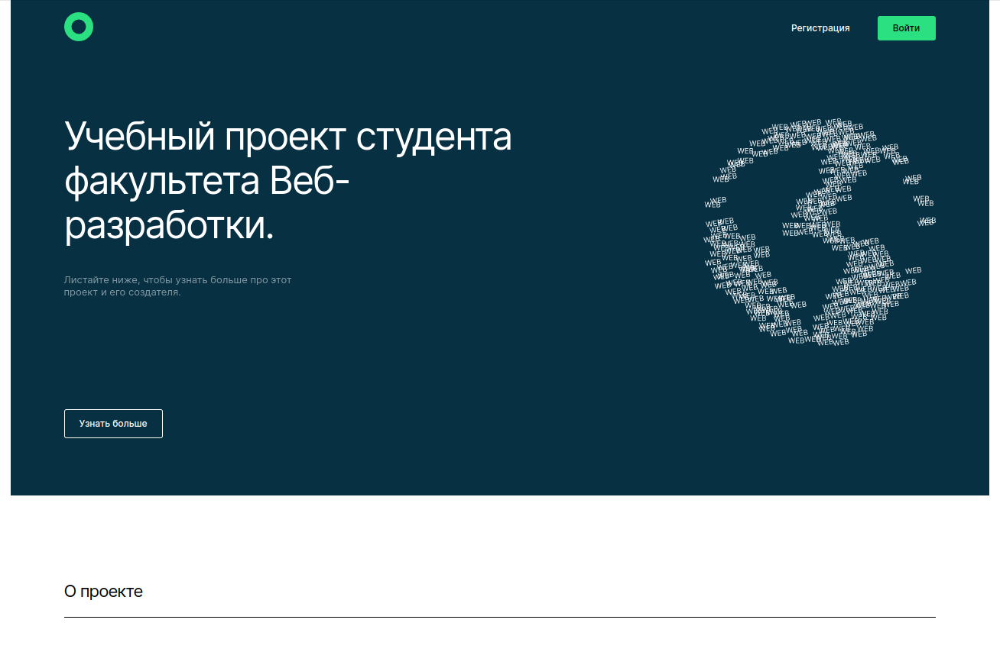

  <b align="center" >Добро пожаловать! Это моя дипломная работа, созданная в рамках обучения на курсе веб-программист</b>
  <b align="center" >Я.Практикума</b>

  В этом репозитории опубликована фронтенд часть приложения. Она отвечает за отображение главной страницы, а после входа или регистрации возможность посетить разделы с видеообозревателем и личный кабинет с сохраненными видеороликами. Также осуществлена возможность редактирования личных данных.
  
  Проект выполнен согласно макету из <a href="https://www.figma.com/file/6FMWkB94wE7KTkcCgUXtnC/Дипломный-проект?type=design&node-id=6-314&mode=design&t=9MvXIshGjQh0Aap3-0" title="Ссылка на проект в Figma">Figma</a> .

## Директории

`/components` -React-компоненты
`/utils` - вспомогательные функции, запросы к API
`/images `- изображения
`/vendor` - файлы сторонних разработчиков

`Стек:`

  <h4 align="center" >Приложение опубликавано на Vercel-pages - <a href="https://movies-explorer-frontend-coral.vercel.app/" title="Ссылка на Vercel Pages">ссылка</a>.</h4>
  
Не забудьте нажать "Открыть в новой вкладке" :wink: 

  

<h4>Код бэкенда опубликован в репозитории - <a href="https://github.com/NadyaDor/movies-explorer-api" title="Ссылка на Github">ссылка</a>.</h4>

**Краткое резюме**:
Дипломный проект был написан и запущен на хостинг в течении 5 недель. Было интересно и волнительно от и до выполнить и запустить его самостоятельно без помощи наставников. К сожалению, в данный момент, без "прикрученного" бэкенда, опубликованный проект в Versel не имеет полного функционала, который присутствует в коде. Со временем при наличии времени иправлю это.
